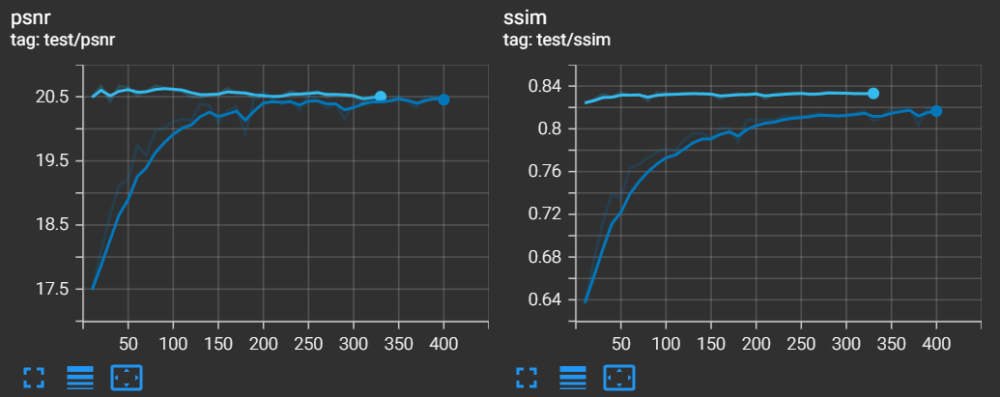
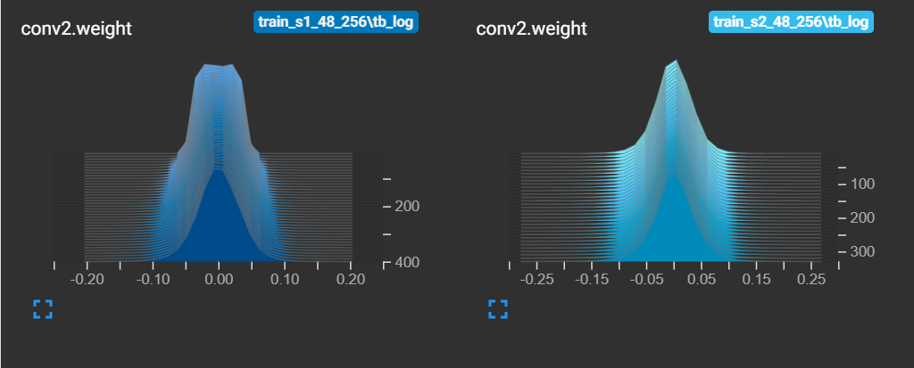

# BMD-GAN tutorial using simulation

Tutorial code for papers\
[BMD-GAN: Bone Mineral Density Estimation Using X-Ray Image Decomposition into Projections of 
Bone-Segmented Quantitative Computed Tomography Using Hierarchical Learning](https://link.springer.com/chapter/10.1007/978-3-031-16446-0_61)\
and\
[Bone mineral density estimation from a plain X-ray image by learning decomposition into projections of 
bone-segmented computed tomography](https://doi.org/10.1016/j.media.2023.102970).

[MICCAI '22 Oral](https://link.springer.com/chapter/10.1007/978-3-031-16446-0_61) | [arXiv1](https://arxiv.org/abs/2207.03210) | [arXiv2](https://arxiv.org/abs/2307.11513)

Method overview


## 1. Simulation
Due to the IRBs limitation and commercialization purposes, the data and source code in the papers can not be published.\
Instead, we use a simulated task to be the proof-of-concept using [Oxford-IIIT Pet Dataset](https://www.robots.ox.ac.uk/%7Evgg/data/pets/)
as shown below.

In this simulation, the ```noise```, ```pet with boarder```, and ```pet``` are regarded as 
```soft tissues```, ```bone```, ```proximal femur bone```,
respectively.

### 1.1 NOTE
For intellectual property protection, this code uses basic deep learning techniques, which are different from that used in the papers.\
There is no guarantee of the same performance as in the papers even with the same dataset (which though cannot be published), using this code.

### 1.2 What's in the code?
1. Basic epoch-based training framework (training, evaluation, visualization, saving, and loading).
2. Pet dataset loading pipeline. 
3. HRNet model architecture.
4. Loss functions used in the paper.
5. Image decomposition evaluation (using PSNR and SSIM).
6. Results visualization.

### 1.3 What's NOT in the code?
1. Model architectures other than HRNet.
2. Trained model weights.
3. Datasets pipeline used in the papers.
4. Datasets construction algorithms.
5. Affine and color augmentation. 
6. Stage three. 
7. Deriving BMD from DRR.


## 2. Training
### 2.1 Test environment
OS: Ubuntu 22.04\
CPU: Intel(R) Core(TM) i9-10980XE CPU @ 3.00GHz x1\
GPU: RTX 3090 24GB x1\
docker: akihikokayaba/bmdgan-tutorial

python 3.11\
pytorch 2.0.1+cu12.1\
scikit-image, opencv, eniops, tensorboard, torchmetrics, yacs, pandas, matplotlib

### 2.2 Run training
This tutorial uses HRNet as backbone with 256x256 image size.\
If you encountered OOM, try to reduce image size, batch size, or HRNet scale (HRNet18, HRNet32).\
If the training takes too long, try to reduce number of training epochs.\
For detailed settings, please refere to ```config/train_s1_48_256.toml```.

Execute stage 1 training:
```bash
python train.py --config_path config/train_s1_48_256.toml
```
Execute stage 2 training:
```bash
python train.py --config_path config/train_s2_48_256.toml
```

### 2.3 Training log
Tensorboard log can be found in ```output/train_s1_48_256/tb_log```.
open by
```bash
tensorboard --logdir output/train_s1_48_256/tb_log
```

Loss log (dark blue: stage 1, light blue: stage 2):


Test log and layer weight histogram:
<p>


</p>

Intermediate images from epoch 10 (first row) and epoch 100 (second row) of stage 1


## 3. Testing and visualizing
### 3.1 testing for PSNR and SSIM
Execute stage-one test:
```bash
python test.py --config_path config/test_s1_48_256.toml
```
The results (.csv file) will be stored in ```output/test_s1_48_256```.


Execute stage-two test:
```bash
python test.py --config_path config/test_s2_48_256.toml
```
The results (.csv file) will be stored in ```output/test_s2_48_256```.\
Visualizing these data will be included in the optional section 4.

### 3.2 Visualizing representative samples
Visualizing the best, median, and the worst samples with respect to PSNR.

For stage one:
```bash
python visual_inference.py --config_path config/visual_inference_s1_48_256.toml
```
The result image will be stored in ```output/test_s1_48_256```.

For stage two:
```bash
python visual_inference.py --config_path config/visual_inference_s2_48_256.toml
```
The result image will be stored in ```output/test_s2_48_256```.


## 4. (Optional) Model scale comparison
Quantitative comparison between HRNet18, HRNet32, and HRNet48.

### 4.1 Training
Train HRNet18 and HRNet32:
```bash
python train.py --config_path config/train_s1_18_256.toml  # HRnet18 stage 1
python train.py --config_path config/train_s1_32_256.toml  # HRnet32 stage 1
python train.py --config_path config/train_s2_18_256.toml  # HRnet18 stage 2
python train.py --config_path config/train_s2_32_256.toml  # HRnet32 stage 2
```

### 4.2 Testing
Test HRNet18 and HRNet32:
```bash
python test.py --config_path config/test_s1_18_256.toml  # HRnet18 stage 1
python test.py --config_path config/test_s1_32_256.toml  # HRnet32 stage 1
python test.py --config_path config/test_s2_18_256.toml  # HRnet18 stage 2
python test.py --config_path config/test_s2_32_256.toml  # HRnet32 stage 2
```

### 4.3 Visualizing evaluation results
```bash
python visual_test.py --config_path config/visual_test_s1_256.toml  # stage 1
python visual_test.py --config_path config/visual_test_s2_256.toml  # stage 2
```


## Citation
```bibtex
@article{bone_gu_2023,
title = {Bone mineral density estimation from a plain X-ray image by learning decomposition into projections of bone-segmented computed tomography},
journal = {Medical Image Analysis},
volume = {90},
pages = {102970},
year = {2023},
issn = {1361-8415},
doi = {https://doi.org/10.1016/j.media.2023.102970},
url = {https://www.sciencedirect.com/science/article/pii/S136184152300230X},
author = {Yi Gu and Yoshito Otake and Keisuke Uemura and Mazen Soufi and Masaki Takao and Hugues Talbot and Seiji Okada and Nobuhiko Sugano and Yoshinobu Sato},
}

@inproceedings{bmdgan_gu_2022,
title = {BMD-GAN: Bone Mineral Density Estimation Using X-Ray Image Decomposition into Projections of Bone-Segmented Quantitative Computed Tomography Using Hierarchical Learning},
Author = {Yi Gu and Yoshito Otake and Keisuke Uemura and Mazen Soufi and Masaki Takao and Nobuhiko Sugano and Yoshinobu Sato},
booktitle = {Medical Image Computing and Computer Assisted Intervention -- MICCAI 2022},
pages = {644--654},
year = {2022},
address= {Cham},
}
```